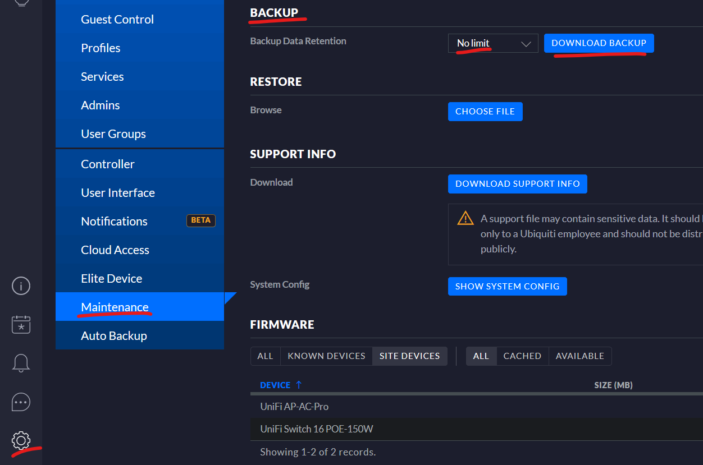
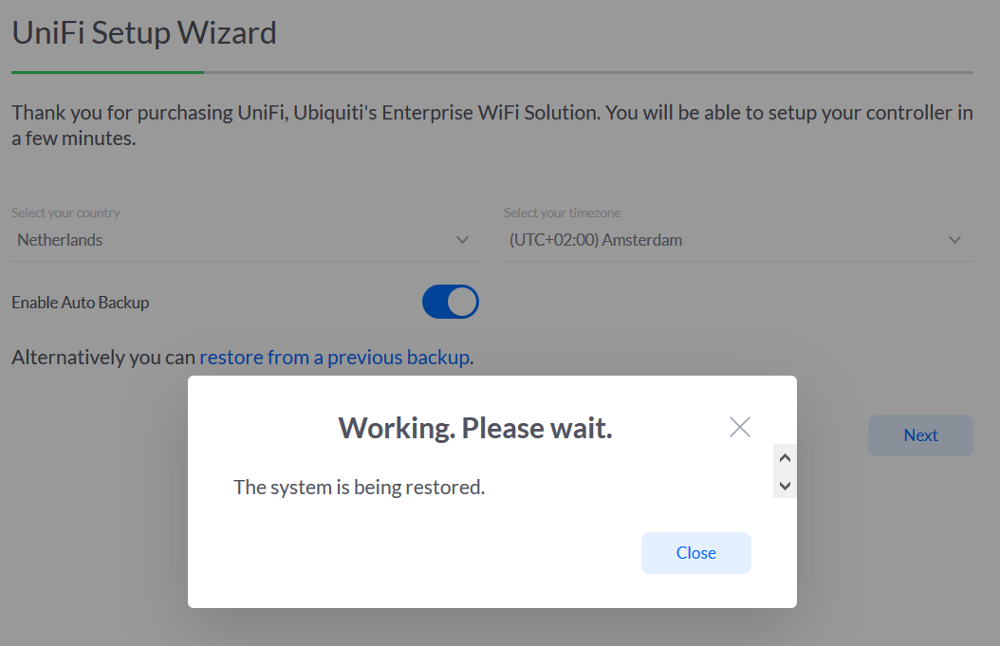
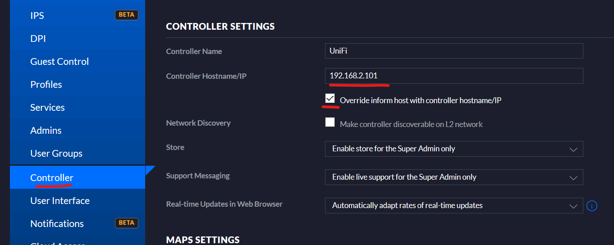

# Migrate application and databases from Windows to Docker containers

Welcome to my fourth article about my journey into containerizing my Home IoT network. After installing Debian 10 and Docker (with Compose) I'm ready to migrate my UniFi controller from Windows 10 to a Docker container on Linux.

## UniFi controller migration

First I create a back-up on my running controller at Windows 10. To migrate my complete UniFi hardware to the new controller I keep the IP address of the controller the same. Else I have to adopt all devices again. This is easy, but takes some time, and I rather spend the time on sipping coffee.

**In this article I use the 192.168.2.101 IP address of my server as an example. It may be clear that you must use your own IP address.**

### Create a back-up of the UniFi controller database

Log in to the UniFi controller at `https://192.168.2.101:8443`

* Click on the **gear icon** in the **left** toolbar,
* Click on the **Maintenance** menu item,
* In the **Backup** section set **No Limit** in the **Backup data retention** option,
* Click **Download backup** and **save** the file on your local drive.



Now **shutdown** the UniFi controller application on Windows 10.

### Change the Windows 10 IP address

Open a **Command Prompt** with *Elevated Rights* and type the following command to *change* the IP address of the network adapter named *Ethernet* to **192.168.2.110** with gateway **192.168.2.254**:

`netsh interface ip set address name="Ethernet" static 192.168.2.110 255.255.255.0 192.168.2.254`

### Change the Debian 10 IP address

In my second article I showed you how to install Debian 10 and I set a temporary static IP address, now I change it to the IP address 192.168.2.101 (which was the old server address):

Edit the file `/etc/network/interfaces` to change it to the following:

```
auto eno1
iface eno1 inet static
    address 192.168.1.101
    subnet 255.255.255.0
    gateway 192.168.1.254
```

Restart the networking services or reboot with the command:

`sudo systemctl reboot`

### Create the Docker Compose configuration

Now you are ready to create a Docker Compose file for the UniFi controller configuration.

First **create a folder** named *unifi* (in your home folder for example) and within this folder **create a file** named: **docker-compose.yml** with the following YAML code:

```
version: '3.7'

services:
  controller:
    image: "jacobalberty/unifi:${TAG:-latest}"
    container_name: unifi-controller
    hostname: unifi
    ports:
      - "3478:3478/udp"   # STUN
      - "6789:6789/tcp"   # Speed test
      - "8080:8080/tcp"   # Device/ controller comm.
      - "8443:8443/tcp"   # Controller GUI/API as seen in a web browser
      - "8880:8880/tcp"   # HTTP portal redirection
      - "8843:8843/tcp"   # HTTPS portal redirection
      - "10001:10001/udp" # AP discovery
    environment:
      TZ: 'Europe/Amsterdam'
    volumes:
      - ./data:/unifi/data
      - ./log:/unifi/log
      - ./cert:/unifi/cert
    init: true
    restart: always
```

This Docker Compose file *downloads* the latest UniFi Docker image from	 *jacobalberty* and creates tree Docker Volumes for the data, log and personal certificated. This ensures when you update the container in the future, or reboot the system the database is maintained.

### Run the Docker Container

Now run the command `docker-compose up -d` to download (at first time run) the Docker image and fire up the container in daemon mode (in the background).

Check if the container is running with the command: `docker ps`

### Import the UniFi controller database

If the UniFi container is running you can restore the database. In your favorite browser go to:

`https://192.168.1.101:8443`

The UniFi installation wizard shows and click the option to restore an existing database to restore the data:



### Adopt UniFi devices to your new controller

The Docker container exposes it's Docker IP address. To automatically adopt your current devices:

* Click on the **gear icon** in the **left** toolbar,  
* Click on the **Controller** menu item,
* In the **Controller Settings** section type the IP address of the* Docker host machine* in the **Controller Hostname/IP** field,
* Check the **Override inform host with controller** hostname/IP checkbox,
* **Save** the settings.



Now restart the container by running `docker-compose down` in the *unifi* folder followed up by `docker-compose up -d`.

If you have configured everything correctly you migrated your UniFi controller to a Docker container and all devices are adopted!

## DSMR-reader migration

Migrating the UniFi controller database is easy. Therefore I also show you how I migrated my DSMR-reader database which is PostgreSQL. I ran DSMR-reader on a Debian 9 host running in VirtualBox with USB forwarding. DSRM-reader reads my smartmeter with a P1 cable connected to the USB port of my Intel® NUC Kit and has a large database.

postgres pg_dump -d dsmrreader -v | gzip --fast > /home/joep/dsmrdb-backup.sql.gz

copy over with scp to new server

create compose file

run docker

docker-compose stop dsmr
docker exec -t dsmr-database dropdb dsmrreader -U dsmrreader
docker exec -t dsmr-database createdb -O dsmrreader dsmrreader -U dsmrreader
cat dsmrreader.sql | docker exec -i dsmr-database psql -U dsmrreader
docker-compose start dsmr

docker exec -i wordpress-database mysql -uwpsql -pkpAKMHIoy1f53TG5HMOu < verhaegjes-wordpress-database.sql

docker exec -i wordpress-database mysql -uwpsql -pkpAKMHIoy1f53TG5HMOu --database wordpress < verhaegjes-wordpress-database.sql