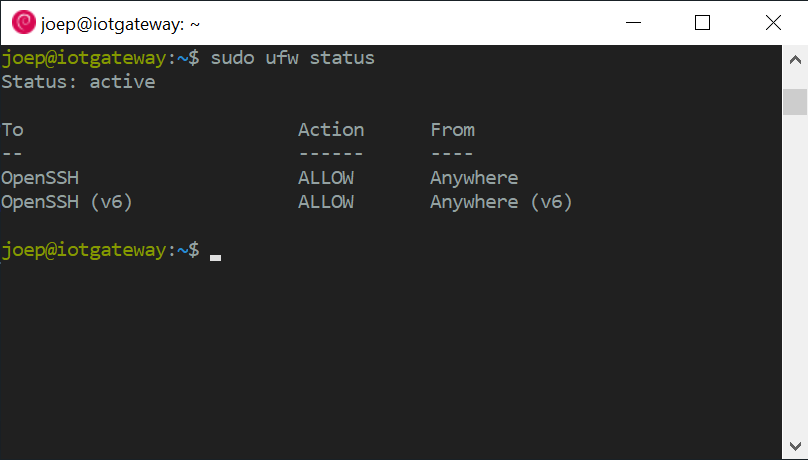

# Install and harden Debian 10 to build a Docker host

In part 1 of my journey into containerizing my Home IoT network I sketched my IoT landscape and what it would be when it is all containerized. In this article I write about configuring the system for optimal use and securing (hardening) the default Debian 10 installation for remote access with SSH.

## Minimal server installation on Intel® NUC Kit

I assume you know how you install Debian. Remember to use a strong root and user password. I installed Debian 10 in text mode and only selected the packages `SSH server` and `standard system utilities` to get a minimal server system.


Note: I have an Intel® NUC Kit NUC6i5SYB, and you have to separately download the Wi-Fi drivers. As I connect my NUC with the LAN interface to the network I disabled Wi-Fi (and bluetooth) in the BIOS.

## First install Vim!

The system I installed is minimal. Even *Vim* is not installed! Therefore I login at the *console* with the *root* account and install Vim as the first step after installation: `apt-get install vim`.

## Set a static IP address and correct DNS server

Debian installs by default with DHCP enabled. Edit the file `/etc/network/interfaces` to change it to a static address:

```
auto eno1
iface eno1 inet static
    address 192.168.1.100/24
    gateway 192.168.1.254
```

To set the correct DNS servers edit `/etc/resolv.conf` and add your Internet router and Google's DNS servers as back-up:

```
nameserver 192.168.1.254
nameserver 8.8.8.8
```

Restart the system to make sure it boots correctly. Debian 10 has fully switched to *Systemd* which means that the traditional commands to reboot a system like `shutdown -r now` or `reboot` will not work anymore. The command to reboot your system is `systemctl reboot`.

## Granting my personal user administrative privileges

To avoid using the *root* account for administrative purposes I granted my login *joep* administrative privileges. This will allow my personal account to run commands with administrative privileges by using the `sudo` command. 

First install the *sudo* package (logged in as root): `apt-get install sudo` and add your account to the *sudo* group: `usermod -aG sudo joep`.

## Configure a basic firewall

Running a firewall on every server is a best practice. I use the UFW firewall to set firewall policies and manage exceptions. First I have to install the UFW package: `sudo apt-get install ufw`

I want the firewall to allows SSH connections so I can log in from a remote machine. I allow this by typing: `sudo ufw allow OpenSSH` and enable the firewall with the command `sudo ufw enable`. Check if SSH is still allowed by typing: `sudo ufw status`:



## Set up SSH keys for easy and secure remote access

SSH keys are more difficult to hack than passwords and thus are more secure. Unlike passwords, the private SSH key isn't sent to the server and the SSH connection can only come from the client where the private key resides. For extra security you can add a password to your SSH key to enable multi-factor authentication to increase security even more.

### Create the RSA key pair

If you don't have a key pair yet, create one on your client machine with the command: `ssh-keygen`. By default a *2048-bit* RSA key pair is created.


### Copy the public key to the server

The easiest way to copy your public key to your new Debian 10 server is to use the command: `ssh-copy-id joep@iotgateway`

```
Number of key(s) added: 1

Now try logging into the machine, with:   "ssh 'joep@iotgateway'"
and check to make sure that only the key(s) you wanted were added.
```

### Disable password authentication the server

Password-based authentication is still active, so your server is still exposed to brute-force attacks. Therefore I disable password-based authentication in the SSH daemon configuration by editing the file `/etc/ssh/sshd_config` and change the directive called *PasswordAuthentication*:

```
...
PasswordAuthentication no
...
```

### Disable SSH login for the root user

In the same configuration file I disable the *root* account for remote access to give my server some extra security.

```
...
PermitRootLogin no
...
```

Now restart the SSH daemon with the command: `sudo systemctl restart sshd.service`.
