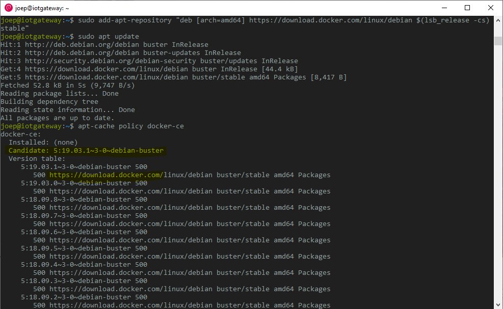
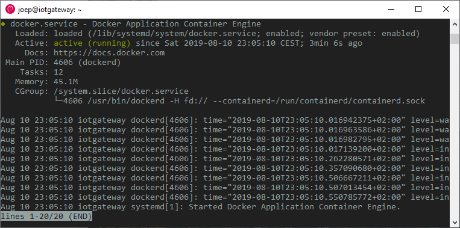

# Install Docker and use Docker on Debian 10  <!-- omit in toc -->

## Table of Contents <!-- omit in toc -->
- [vla](#vla)

## Intro here
Yes, I need to type a catchy introduction!

## Install prerequisites (which let apt use packages over HTTPS):

`sudo apt install apt-transport-https ca-certificates curl gnupg2 software-properties-common`

## Installing Docker

### Get things ready to install
Now we're going to install Docker from the official repository, but first get the system ready with a couple of commands at the server: 

* Add the GPG key for the official Docker repository to your system,
* Add the Docker repository to APT sources,
* Update the local package database.

```
$ curl -fsSL https://download.docker.com/linux/debian/gpg | sudo apt-key add -
$ sudo add-apt-repository "deb [arch=amd64] https://download.docker.com/linux/debian $(lsb_release -cs) stable"
$ sudo apt update
```

Make sure you are about to install from the Docker repo instead of the default Debian repo with the command:

`apt-cache policy docker-ce`

Notice that *docker-ce* is not installed, but it is candidate for installation from the Docker repository: 



### Install Docker

Type the command: `sudo apt install docker-ce` to install Docker. After a while Docker is installed and the daemon started. To check that everything is running type the command: `sudo systemctl status docker`:



## Run the Docker command without using sudo everytime

Docker runs only as *root* or if the user belongs to the *docker group*. This group is automatically created during installation. I don't want to type *sudo* everytime I run the Docker command so I add my user *joep* to the *docker* group with the command: `sudo usermod -aG docker joep` and log out and back in.

Hooray! Docker is installed!

## Fix the Docker and UFW security flaw

Before you grab a beer, Docker has a UFW security flaw by not honoring the UFW rules. 

Edit the file `/etc/default/docker` and add the line:

```
DOCKER_OPTS="--iptables=false"
```

Restart the Docker daemon with the command `sudo systemctl restart docker`. From now on when deploying a container it will no longer alter iptables and will honor UFW.

## Get pihole as a first test

Pull the official pihole image:

`docker pull pihole/pihole'


## Docker cheat sheet
| Docker command            | Description                                                                                            |
|---------------------------|--------------------------------------------------------------------------------------------------------|
| docker images             | To see the images that have been downloaded to your computer.                                          |
| docker search unifi       | Search for UniFi images available on Docker Hub.                                                       |
| docker pull pihole/pihole | Download the official piHole docker image from DockerHub.                                              |
| docker run -it unifi      | The combination of the -i and -t switches gives you interactive shell access into the UniFi container. |
| docker ps                 | View active containers.                                                                                |
| docker ps -a              | View all containers.                                                                                   |
| docker ps -l              | View the last container you added.                                                                     |
| docker start d42d0bbfbd35 | Start a stopped container.                                                                             |
| docker stop d42d0bbfbd35  | Stop a container.                                                                                      |
| docker rm d42d0bbfbd35    | Remove a container                                                                                     |

## Extra's
`sudo apt install dnsutils`
