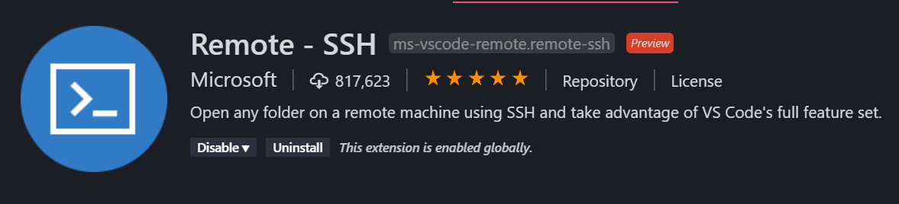

# Install and remotely manage Docker with Visual Studio Code  <!-- omit in toc -->

## Table of Contents <!-- omit in toc -->
- [Intro here](#intro-here)
- [Install prerequisites](#install-prerequisites)
- [Install Docker](#install-docker)
  - [Add the GPG key and Docker repository](#add-the-gpg-key-and-docker-repository)
  - [Installation](#installation)
  - [Run the Docker command without using sudo everytime](#run-the-docker-command-without-using-sudo-everytime)
- [Install Docker Compose](#install-docker-compose)
- [Install Visual Studio Code](#install-visual-studio-code)
  - [Windows Subsystem for Linux](#windows-subsystem-for-linux)
  - [Download and Installation](#download-and-installation)
  - [Remote - SSH Extention](#remote---ssh-extention)
  - [Connect Visual Studio Code to the server](#connect-visual-studio-code-to-the-server)
  - [And now the magic happens!](#and-now-the-magic-happens)
- [First steps: How to use the Docker command](#first-steps-how-to-use-the-docker-command)
  - [Docker cheat sheet](#docker-cheat-sheet)
- [Kaboom! Docker is installed and the first steps into containerization are made!](#kaboom-docker-is-installed-and-the-first-steps-into-containerization-are-made)

## Intro here
Welcome to my third article about my journey into containerizing my Home IoT network. In part 2 I installed Debian 10 on my Intel® NUC Kit and secured remote access with SSH keys. In this article I write about installing Docker (Compose) and connecting Visual Studio Code to my server with Remote-SSH to create a very cool Docker management environment.

## Install prerequisites

Before installing Docker I have to install some prerequisites to let apt use packages over HTTPS:

`sudo apt install apt-transport-https ca-certificates curl gnupg2 software-properties-common`

## Install Docker

Now I'm going to install Docker from the official repository. To be able to do that I first have to: 

* Add the GPG key for the official Docker repository to your system,
* Add the Docker repository to APT sources,
* Update the local package database.

### Add the GPG key and Docker repository

Execute the following commands to add the Docker repository to the system:

```
$ curl -fsSL https://download.docker.com/linux/debian/gpg | sudo apt-key add -
$ sudo add-apt-repository "deb [arch=amd64] https://download.docker.com/linux/debian $(lsb_release -cs) stable"
$ sudo apt update
```

I want to make sure that I install Docker from the official repository instead of the default Debian repo with the command:

`apt-cache policy docker-ce`

Notice that *docker-ce* is **not** installed, but it is *candidate for installation* from the Docker repository:


### Installation

Execute the command: `sudo apt install docker-ce` to install Docker. After a while Docker is installed and the daemon is started. To check that everything is running type the command: `sudo systemctl status docker`:


As you see, everything is running fine on my system.

### Run the Docker command without using sudo everytime

Docker runs only as *root* or if the user belongs to the docker group. This group is automatically created during installation. I don't want to type *sudo* everytime I run the Docker command so I add my user *joep* to the *docker* group with the command: `sudo usermod -aG docker joep` and log out and back in.

Hooray! Docker is installed!

## Install Docker Compose

Some applications use more than one container (for example, my WordPress site and MariaDB database running in separate containers). I find building and running containers from separate Docker files time-consuming. With Docker Compose you use a YAML file to define (multi-)container applications and I can easily configure the runtime options. I configure all the containers I want from my favorite text editor and run a single `docker-compose up` command to build, configure and spin up all the containers.

I installed the latest release from https://github.com/docker/compose/releases:

```
sudo curl -L https://github.com/docker/compose/releases/download/1.24.1/docker-compose-`uname -s`-`uname -m` -o /usr/local/bin/docker-compose
```

At the time of writing this article the latest release is `1.24.1`. Replace the version in the URL if there is a new release when you are configuring your system.

After installation I set *run* permissions on the Docker Compose binary with the command: 

`sudo chmod +x /usr/local/bin/docker-compose`

## Install Visual Studio Code

I hear you thinking... "I want to spin up a container, and see some awesome shizzle!", but first I show you how I set up Visual Studio Code and connect it to my Debian server via SSH to edit Docker (Compose) Files as I work at a local system.

If you are a Vim god and browse the Internet with Browsh, you can skip this chapter, else read further!

### Windows Subsystem for Linux

When you use Windows 10 and don't have the Windows Subsystem for Linux installed you have to install it first. You can find detailed instructions how to install WSL at the [Windows Subsystem for Linux Installation Guide for Windows 10](https://docs.microsoft.com/en-us/windows/wsl/install-win10) from Microsoft.

### Download and Installation

After you installed WSL, download and install Visual Studio Code from: https://code.visualstudio.com/.

### Remote - SSH Extention

Fire up Visual Studio code and from the *Visual Studio Marketplace* install the *[Remote - SSH extention](https://marketplace.visualstudio.com/items?itemName=ms-vscode-remote.remote-ssh)*.




Microsoft wrote [an article](https://code.visualstudio.com/docs/remote/wsl) about developing in WSL. It contains extentions for Remote SSH and Containers. For this article only remoting with SSH is needed, but if you want the full package the article is a nice read.

### Connect Visual Studio Code to the server

Press `F1 ` to bring up the *Command Palette* and type in `remote-ssh`:


Choose the option `Remote-SSH: Connect to Host...` and type your `username@hostname` in the box:


A new Visual Studio Code window opens which asks you for the password you added to your SSH key (in part 2 of my Docker series):


When successfully authenticated Visual Studio Code installs VSCode Server into your server's home folder and connects the IDE to it.

### And now the magic happens!

With everything set you are now editing Docker (Compose) files with Visual Studio Code as if you are working local on the server. The remote filesystem is visible in the *Explorer*. With `Ctrl+Shift+\`` you can launch a terminal to run Docker commands! How awesome is this!


## First steps: How to use the Docker command

Before I show you how I migrate my UniFi Controller from a Windows 10 installation to a Docker container I show you some basic Docker commands by pulling an image from DockerHub.

Pull the Hello World example from DockerHub with the command:

`docker pull hello-world`


After the image is downloaded you can run it:


`docker run hello-world`

The Docker container is build and started and shows you the following output:

```
Hello from Docker!
This message shows that your installation appears to be working correctly.

To generate this message, Docker took the following steps:
 1. The Docker client contacted the Docker daemon.
 2. The Docker daemon pulled the "hello-world" image from the Docker Hub.
    (amd64)
 3. The Docker daemon created a new container from that image which runs the
    executable that produces the output you are currently reading.
 4. The Docker daemon streamed that output to the Docker client, which sent it
    to your terminal.

To try something more ambitious, you can run an Ubuntu container with:
 $ docker run -it ubuntu bash

Share images, automate workflows, and more with a free Docker ID:
 https://hub.docker.com/

For more examples and ideas, visit:
 https://docs.docker.com/get-started/
 ```

Hooray! Your Docker installation appears to be working correctly.

With `docker ps` you can see the containers that are running: 


The image `hello world` is not in the list of running containers because it just showed some text and doesn't have a running process.

If you don't want to waste storage space with the `hello-world` example, remove the image with the command:

`docker rmi hello-world`

### Docker cheat sheet

This is the very basic use of Docker commands, I created a cheat sheet with other usefull commands:

| Docker command               | Description                                                                                                               |
|------------------------------|---------------------------------------------------------------------------------------------------------------------------|
| docker images                | To see the images that have been downloaded to your server.                                                               |
| docker rmi hello-world       | Remove the hello-world image.                                                                                             |
| docker search unifi          | Search for UniFi images available on Docker Hub.                                                                          |
| docker pull pihole/pihole    | Download the official piHole Docker image from DockerHub.                                                                 |
| docker run -p pihole         | Run an image in detached mode.                                                                                            |
| docker run -it unifi         | Runs an image, creating a container and changing the terminal to the terminal within the container.                       |
| docker ps                    | List all running containers.                                                                                              |
| docker ps -a                 | List all containers (running and not running).                                                                            |
| docker ps -l                 | View the last container you added.                                                                                        |
| docker start d42d0bbfbd35    | Start a container.                                                                                                        |
| docker stop d42d0bbfbd35     | Stop a container.                                                                                                         |
| docker rm -f d42d0bbfbd35    | Delete a container.                                                                                                       |

## Kaboom! Docker is installed and the first steps into containerization are made!

The next step is migrating my HomeLab IoT services to Docker. Stay tuned for the next article where I write about this process!

